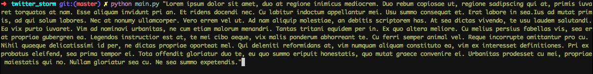

# Loggi Twitter-storm
This is a hiring challenge of Loggi company. The proposal is doing a Tweet Storm, which consist in an app that is able to bypass twitter limit(considering 140 chars) by breaking the message in a sequence of messeges which will be associeted by used as replies and passing a header "(index/total)".

## How to use it?

First of all, you need to clone this repository by running

`git clone git@github.com:walteraa/loggi-tweet-storm.git`

And you need to have `pip` and setuptools installed on your machine

```
~/loggi-tweet-storm$ sudo apt install python-pip
Reading package lists... Done
Building dependency tree
Reading state information... Done
The following additional packages will be installed:
  python-pip-whl
(...)
```

```
~/loggi-tweet-storm$ pip install setuptools
Collecting setuptools
  Downloading https://files.pythonhosted.org/packages/7f/e1/820d941153923aac1d49d7fc37e17b6e73bfbd2904959fffbad77900cf92/setuptools-39.2.0-py2.py3-none-any.whl (567kB)
    100% |████████████████████████████████| 573kB 1.2MB/s
Installing collected packages: setuptools
Successfully installed setuptools
```

Then you'll be able to install the requirements libs by running:

```
pip install -r requirements.txt
Collecting python-twitter (from -r requirements.txt (line 1))
(...)
```

I Decided to use two thirdy party libs:

python-twitter: To make easier to send request to the Twitter API(We don't need reinvent the wheel, right? :P )
pytest: To be used as unit test

Now you can install the libs by running:

```
~/loggi-tweet-storm$ sudo python setup.py install
running install
running bdist_egg
running egg_info
writing twitter_storm.egg-info/PKG-INFO
writing top-level names to twitter_storm.egg-info/top_level.txt
writing dependency_links to twitter_storm.egg-info/dependency_links.txt
(...)
```


> You can make easier manage this by running it in a container, you can see more details in the [Running on Docker](#running-on-docker) section

## Running tests

You can also run unit tests

```
~/loggi-tweet-storm$ python -m pytest -v
=========================================================================================== test session starts ============================================================================================
platform linux2 -- Python 2.7.12, pytest-3.5.1, py-1.5.3, pluggy-0.6.0 -- /usr/bin/python
cachedir: .pytest_cache
rootdir: /home/ubuntu/loggi-tweet-storm, inifile:
collected 5 items

tests/txt_process_test.py::TestTweetBreak::test_length PASSED                                                                                                                                        [ 20%]
tests/txt_process_test.py::TestTweetBreak::test_size_of_tweet PASSED                                                                                                                                 [ 40%]
tests/txt_process_test.py::TestTweetBreak::test_tweet_index PASSED                                                                                                                                   [ 60%]
tests/txt_process_test.py::TestTweetBreak::test_tweets_type PASSED                                                                                                                                   [ 80%]
tests/txt_process_test.py::TestTweetBreak::test_uniquetweet_breaker PASSED                                                                                                                           [100%]

========================================================================================= 5 passed in 0.02 seconds =========================================================================================
```

## Running the app

When running the app in your system, you need to set up environments variables of twitter apps, which you can create by visiting [https://apps.twitter.com/](https://apps.twitter.com/), for now I've created a temp app, which will be destroyed after this project evaluation.

To set up this environment variables, you just need to use your shell comand for it(Note that I am using fish shell for it)


After set up the app environment variables, you are able to run the app and send the broked tweet:




#### Authorizing the app
This command will start the application, which will altomatically prepare the mensage and comunicate with the Twitter API using the app key/secret, but now it's time to you authorize the app to use your credentials. The app will ask you to access a twitter link, wich should be opened in the browser where you account is logged:


A PIN will be generated and you should put it where the app asked you:


Then, after put the PIN and pressed ENTER, the app will send the tweet to Twitter and return the Tweet URL


And you can check it in the Twitter web site(using the URL) through browser or Twitter mobile app


## Running on Docker

If you don't want to do lots of configuration proccess, if you have Docker installed on your machine, you are able to create a docker container to use the app.

First of all, you need to build the image


Then, you should start a container in the same time you configure the app key/secret


Then, you should run the app start command and do the same as in [authorization section](#authorizing-the-app) and add the PIN where the app asks you


Then finally your tweet will apear in the Twitter 


